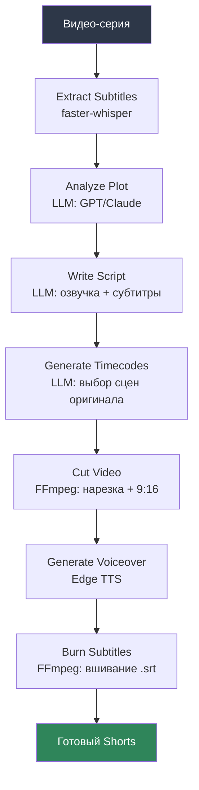
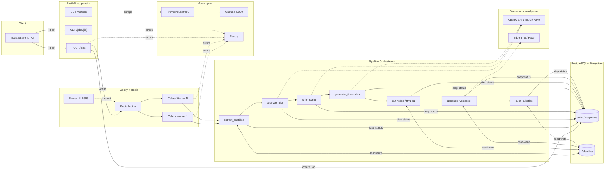

# AI Shorts Pipeline

Автоматизированный пайплайн превращения длинных видео в короткие YouTube Shorts
(40–60 секунд) с использованием LLM для анализа сюжета и написания сценария,
FFmpeg для монтажа и TTS для озвучки.

> **⚠️ Важно про авторские права.** Этот проект — инженерное портфолио-демо
> пайплайна обработки видео, а не готовое решение для монетизации чужого контента.
> Использование сторонних видео (мультсериалов, фильмов и т.д.) без прав
> правообладателя нарушает авторское право и почти наверняка приведёт к
> Content ID claim/страйку на YouTube — система детектирует контент даже
> после нарезки и переозвучки. Для реального использования: применяйте
> собственные видео, контент с явной лицензией (Creative Commons) или
> материалы, на которые у вас есть права.

## Зачем это написано

Учебный/портфолио-проект, демонстрирующий типичный production-grade backend
для асинхронной AI-обработки медиа:

- FastAPI + async SQLAlchemy — неблокирующий API-слой
- Celery + Redis — очередь долгих задач (обработка видео — это минуты, не миллисекунды)
- Pluggable-провайдеры (LLM/TTS/Storage) — Strategy pattern, легко добавить новый
- Полноценный мониторинг (Prometheus + Grafana + Flower + Sentry)
- Тесты на каждом слое + CI/CD через GitHub Actions

## Архитектура пайплайна



## Системная архитектура



## Стек

| Слой | Технология |
|---|---|
| API | FastAPI, async SQLAlchemy 2.0, Pydantic v2 |
| Очередь задач | Celery + Redis, мониторинг через Flower |
| БД | PostgreSQL (asyncpg), миграции Alembic |
| Субтитры | faster-whisper |
| LLM (анализ/сценарий/таймкоды) | OpenAI / Anthropic / Fake (абстракция `LLMProvider`) |
| Озвучка | Edge TTS (бесплатные голоса Microsoft Azure Neural) |
| Видео-монтаж | FFmpeg (subprocess, async) |
| Метрики | Prometheus + Grafana |
| Ошибки | Sentry + structured logging (structlog, JSON) |
| Тесты | pytest, httpx (ASGI-клиент), pytest-celery (eager mode) |
| CI/CD | GitHub Actions (lint → test → build Docker → smoke-test) |

## Быстрый старт

```bash
git clone <repo-url> shorts-pipeline
cd shorts-pipeline
cp .env.example .env        # по умолчанию LLM_PROVIDER=fake — работает без ключей
make up                     # поднимет весь стек через docker-compose
```

После старта доступно:

| Сервис | URL |
|---|---|
| API (Swagger) | http://localhost:8000/docs |
| Flower (очередь задач) | http://localhost:5555 |
| Prometheus | http://localhost:9090 |
| Grafana | http://localhost:3000 (admin / admin) |

## Пример запроса

Создать job на обработку видео:

```bash
curl -X POST http://localhost:8000/api/v1/jobs \
  -H "Content-Type: application/json" \
  -d '{
    "source_video_path": "uploads/episode_01.mp4",
    "source_title": "Episode 1 — The Lesson",
    "target_duration_seconds": 55
  }'
```

Ответ:

```json
{
  "id": "3fa85f64-5717-4562-b3fc-2c963f66afa6",
  "status": "pending",
  "celery_task_id": "c7a1e2f0-9f3a-4b1d-8e3a-1234567890ab"
}
```

Проверить статус и получить детали (прогресс по шагам, артефакты):

```bash
curl http://localhost:8000/api/v1/jobs/3fa85f64-5717-4562-b3fc-2c963f66afa6
```

```json
{
  "id": "3fa85f64-5717-4562-b3fc-2c963f66afa6",
  "status": "success",
  "current_step": null,
  "output_video_path": "/data/storage/jobs/3fa85f64.../final_short.mp4",
  "script": {
    "title": "Краб-патти и урок жадности",
    "voiceover_text": "Мистер Крабс решил сэкономить на ингредиентах..."
  },
  "step_runs": [
    {"step": "extract_subtitles", "status": "success", "duration_seconds": 4.2},
    {"step": "analyze_plot", "status": "success", "duration_seconds": 1.8},
    {"step": "write_script", "status": "success", "duration_seconds": 2.1},
    {"step": "generate_timecodes", "status": "success", "duration_seconds": 1.5},
    {"step": "cut_video", "status": "success", "duration_seconds": 8.7},
    {"step": "generate_voiceover", "status": "success", "duration_seconds": 3.4},
    {"step": "burn_subtitles", "status": "success", "duration_seconds": 5.9}
  ]
}
```

## Переключение LLM-провайдера

Pipeline не завязан на конкретный LLM SDK — провайдер выбирается через `.env`:

```bash
# OpenAI
LLM_PROVIDER=openai
OPENAI_API_KEY=sk-...
OPENAI_MODEL=gpt-4o-mini

# Anthropic
LLM_PROVIDER=anthropic
ANTHROPIC_API_KEY=sk-ant-...
ANTHROPIC_MODEL=claude-sonnet-4-6

# Без ключей — для демо и тестов
LLM_PROVIDER=fake
```

Добавить нового провайдера — реализовать `LLMProvider.complete_json()`
(см. `app/services/llm/base.py`) и зарегистрировать в `app/services/llm/factory.py`.

## Метрики (Prometheus)

Кастомные метрики экспортируются на `/metrics`:

| Метрика | Тип | Описание |
|---|---|---|
| `shorts_job_processing_duration_seconds` | Histogram | Полное время обработки одного видео |
| `shorts_jobs_total{status}` | Counter | Количество job'ов по итоговому статусу |
| `shorts_jobs_in_progress` | Gauge | Job'ов в обработке прямо сейчас |
| `shorts_pipeline_step_duration_seconds{step}` | Histogram | Длительность каждого шага пайплайна |
| `shorts_pipeline_step_failures_total{step}` | Counter | Ошибки по шагам |
| `shorts_llm_request_duration_seconds{provider}` | Histogram | Латентность LLM-запросов |
| `shorts_tts_request_duration_seconds{provider}` | Histogram | Латентность синтеза речи |

Готовый дашборд лежит в `grafana/dashboards/shorts_pipeline_overview.json`
и подгружается автоматически при старте Grafana (provisioning).

## Очередь задач (Flower)

Flower (http://localhost:5555) показывает в реальном времени:
- задачи в очереди / в работе / завершённые / проваленные
- throughput воркеров
- возможность вручную перезапустить упавшую задачу

## Логи и ошибки

- Все логи — структурированные JSON (`structlog`), с `job_id`/`step` в контексте
  каждой записи — удобно агрегировать в ELK/Loki/CloudWatch.
- Необработанные исключения в FastAPI и Celery автоматически летят в Sentry
  (если задан `SENTRY_DSN`; при пустом значении интеграция тихо отключается).

## Тесты

```bash
make test          # локально (нужны установленные зависимости)
make test-docker   # внутри Docker, без локального окружения
```

Структура тестов:

```
tests/
├── conftest.py              # фикстуры: in-memory SQLite, httpx-клиент, fake providers
├── unit/                    # изолированные юнит-тесты (LLM/TTS/storage/ffmpeg/srt)
└── integration/             # API (httpx), полный прогон pipeline, Celery task (eager mode)
```

Внешние зависимости (LLM, TTS, FFmpeg subprocess) в тестах замоканы —
тесты идут быстро и не требуют сети, GPU или API-ключей.

## CI/CD

GitHub Actions (`.github/workflows/ci.yml`) на каждый push/PR:

1. **lint** — ruff (lint + format check) + mypy
2. **test** — pytest с покрытием, ffmpeg устанавливается в раннере
3. **build** — сборка Docker-образов `api` и `worker` (multi-stage Dockerfile),
   публикация в GHCR при пуше в `main`
4. **smoke-test** — поднимает весь стек через `docker compose` и проверяет
   `/health` + создание job'а

## Структура проекта

```
app/
├── api/routes/        # FastAPI роуты (jobs, health)
├── core/               # конфиг, логирование, sentry
├── db/                 # SQLAlchemy модели, сессии
├── pipeline/
│   ├── orchestrator.py # связывает все шаги в последовательность
│   └── steps/          # каждый шаг пайплайна отдельным модулем
├── services/
│   ├── llm/             # абстракция + OpenAI/Anthropic/Fake реализации
│   ├── tts/             # абстракция + Edge TTS/Fake реализации
│   └── storage/         # абстракция + локальный backend (задел на S3)
├── workers/            # Celery app + задачи
└── monitoring/         # Prometheus метрики, трекер шагов

alembic/                # миграции БД
docker/                 # Dockerfile (multi-stage), docker-compose.yml
grafana/, prometheus/   # конфигурация мониторинга
tests/                  # unit + integration тесты
.github/workflows/      # CI/CD
```

## Возможные дальнейшие шаги

- [ ] S3/MinIO storage backend (интерфейс `StorageBackend` уже готов)
- [ ] Celery Beat для периодической проверки новых эпизодов
- [ ] Web UI для просмотра прогресса job'ов (сейчас только REST API + Swagger)
- [ ] A/B тестирование разных LLM-промптов для сценария
- [ ] Автоматическая загрузка готового видео на YouTube через YouTube Data API
